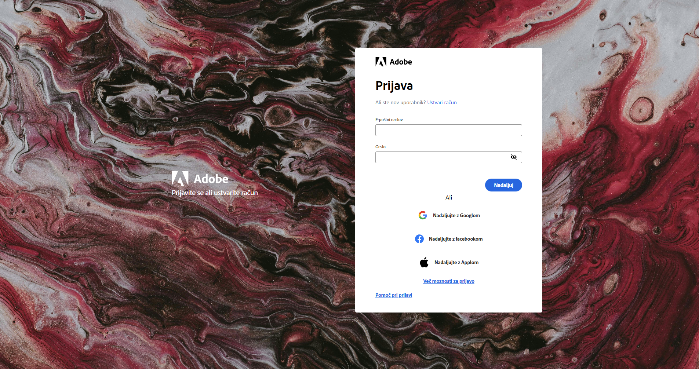
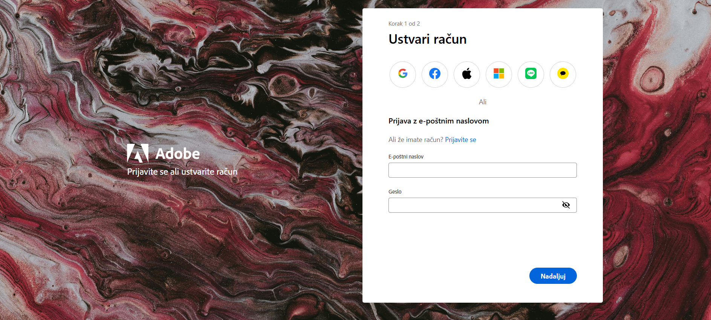
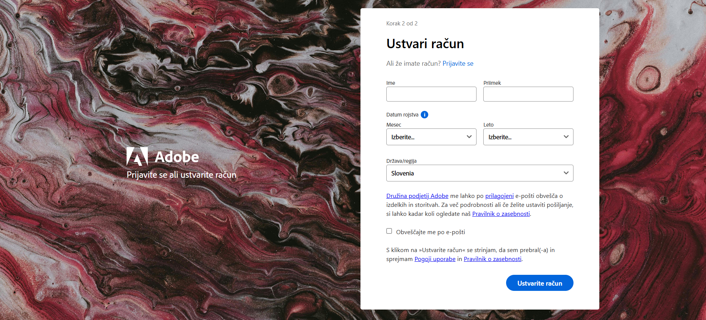

# Adobe Login/Registration Clone

A static website that replicates Adobe's login and registration interface in Slovenian language.

## 📋 Project Description

This project contains a static webpage that accurately mimics the user interface for logging in and registering on the Adobe platform. The page is customized for Slovenian users with all text translated into Slovenian.

## 🚀 Features

- **Login** - Page for existing users to sign in
- **Registration** - New account creation process in two steps
- **Social Login** - Option to sign in via Google, Facebook, and Apple accounts
- **Responsive Design** - Adapts to different screen sizes and devices
- **Slovenian Localization** - Complete interface in Slovenian language

## 🗂️ Project Structure

## 🛠️ Technologies Used

- **HTML5** - Page structure and content
- **CSS3** - Styling and responsive design
- **JavaScript** - Client-side functionality

## 🚀 Getting Started

Open link: https://github.com/gajcermelj.github.io/prijava_adobe/

## 📱 Pages Overview

### Login Page (`index.html`)
- Email/password login form
- Social media login options (Google, Facebook, Apple)
- "Create account" link for new users
  
  

### Registration Pages
- **Part 1** (`register.html`) - Basic account creation
  
  
  
- **Part 2** (`register-drugidel.html`) - Additional user information and preferences
  
  

## 📄 License

This project includes a AGPL-3.0 license

## ℹ️ Note

This is a front-end clone for educational/demonstration purposes only and is not affiliated with Adobe Inc. All Adobe trademarks and logos are property of their respective owners.
